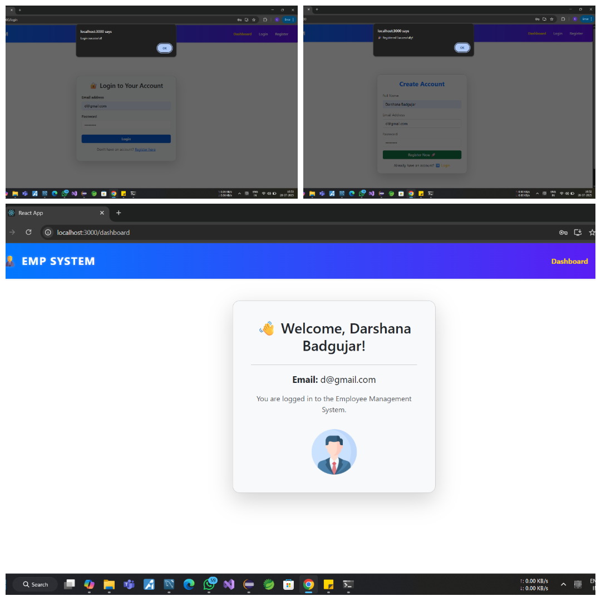

# Employee Management System

This is a basic Employee Management System with Login and Registration functionality. It is built using a full-stack approach.

## 🚀 Features
- Employee Registration Form
- Employee Login Form

## 🛠️ Technologies Used
- **Frontend:** React.js (VS Code)
- **Backend:** Java Spring Boot (Eclipse IDE)
- **Database:** MySQL

## 📸 Application UI

Here’s how the application looks:

